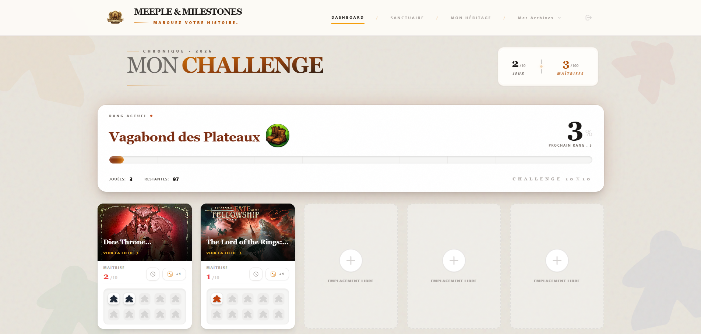
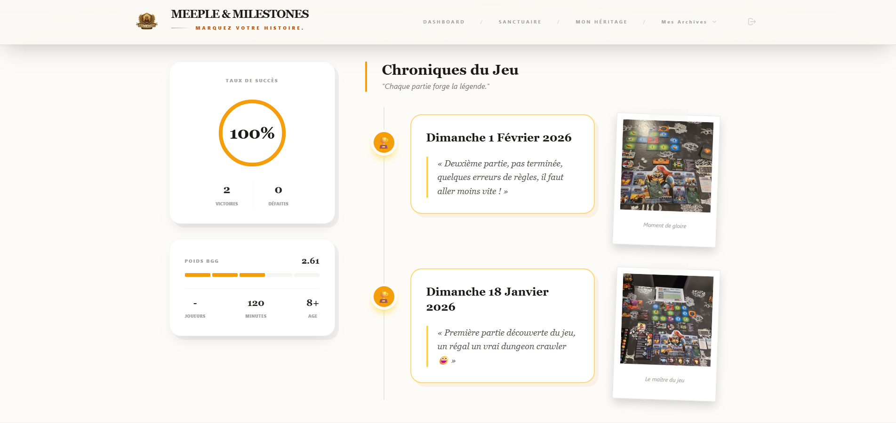
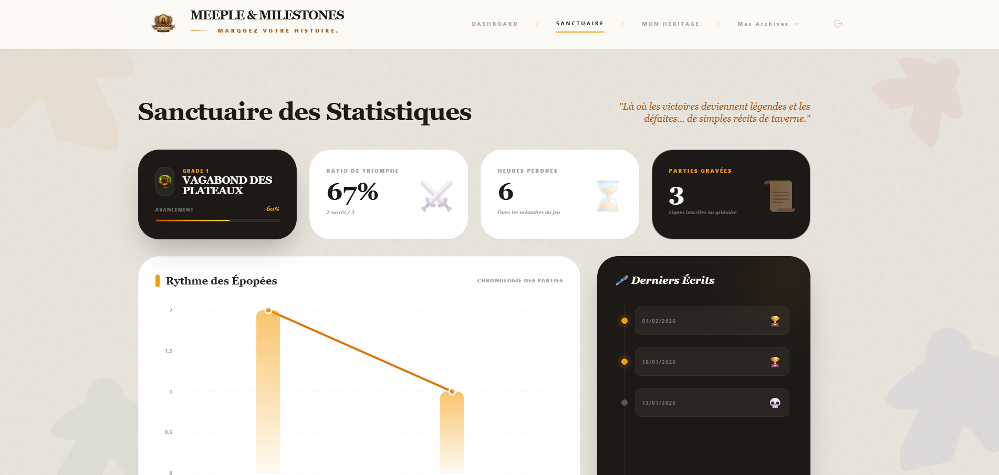

# 🎲 Meeple & Milestones - L'Antre des Légendes


> **Une application "Premium" de suivi de challenges ludiques (10x10), conçue pour les passionnés de jeux de société modernes.**


## 🌟 La Vision du Projet

Ce projet n'est pas un simple "tracker". C'est une tentative de repenser l'expérience utilisateur dans le monde du jeu de société, souvent dominé par des interfaces datées.
L'objectif : **Fusionner l'utile (statistiques) et l'agréable (immersion visuelle)**, avec une direction artistique inspirée des grimoires anciens et du design "Luxe".

---

## 📸 Aperçu du Sanctuaire

| Dashboard Mobile                          | Grimoire d'un Jeu                         | Statistiques Globales             |
| :---------------------------------------- | :---------------------------------------- | :-------------------------------- |
|  |  |  |

## ✨ Fonctionnalités Clés

### 🛡️ Authentification & Profil

- **Grimoire d'accès :** Système de Login/Sign-up entièrement sécurisé via Supabase Auth.
- **Mon Héritage :** Gestion de profil avancée avec possibilité de reforger son sceau (mot de passe) et zone de danger sécurisée (RPC Function) pour la suppression de compte.
- **Persistance :** Session utilisateur maintenue et protégée par `ProtectedRoute`.

### ⚔️ Le Challenge 10x10

- **Dashboard Immersif :** Vue d'ensemble de la progression avec barres dynamiques et design épuré.
- **Moteur de Recherche :** Connexion à une base de données locale de jeux (pré-fetchée depuis BGG) pour une recherche instantanée.
- **Gestion de Collection :** Ajout/Suppression de jeux au challenge, avec gestion automatique des doublons.

### 📜 Le Sanctuaire (Statistiques)

- **Data Visualization :** KPI en temps réel (H-Index, Total de parties, Victoires).
- **Historique :** Journal des quêtes (parties) détaillé avec filtres et tris.
- **Interface Réactive :** Mises à jour en temps réel grâce aux souscriptions Supabase Realtime (Websockets).

---

## 🏗️ Architecture Technique

### Front-End (UX/UI First)

- **React + Vite :** Pour une performance optimale et un rechargement instantané.
- **Tailwind CSS :** Utilisation d'un système de design tokenisé (couleurs `stone`, `amber`, `emerald`) pour une cohérence visuelle parfaite.
- **Framer Motion / CSS Transitions :** Micro-interactions soignées (survol des cartes, apparitions modales, feedback boutons).
- **Responsive Design :** Interface totalement adaptative (Mobile First), avec menu "Tiroir" pour les petits écrans.

### Back-End (Supabase)

- **PostgreSQL :** Base de données relationnelle robuste.
- **Row Level Security (RLS) :** Chaque donnée est isolée. Un utilisateur ne peut voir et modifier que ses données (bien que la bibliothèque de jeux soit publique).
- **RPC Functions :** Logique métier complexe (ex: suppression de compte en cascade) déportée côté serveur pour la sécurité.
- **Realtime :** Synchronisation instantanée des états entre plusieurs onglets/appareils.

### Challenges Techniques Résolus

1.  **Sync Auth & URL :** Gestion fine de la synchronisation entre l'état de l'authentification et les paramètres d'URL pour éviter les boucles de redirection au login.
2.  **Performance BGG :** Mise en cache des données BoardGameGeek pour éviter les latences d'API externes.
3.  **Sécurité des Données :** Implémentation d'une fonction SQL `security definer` pour permettre à un utilisateur de supprimer ses propres données (y compris Auth) sans compromettre la base globale.

---

## 🚀 Installation & Démarrage

```bash
# 1. Cloner le grimoire
git clone [https://github.com/Vangelis-26/meeple-milestones.git](https://github.com/Vangelis-26/meeple-milestones.git)

# 2. Entrer dans le sanctuaire
cd meeple-milestones


# 3. Invoquer les dépendances
npm install

# 4. Configurer les variables d'environnement
# Créer un fichier .env avec :
# VITE_SUPABASE_URL=votre_url
# VITE_SUPABASE_ANON_KEY=votre_cle

# 5. Lancer le sortilège de développement
npm run dev
```

## 👤 Auteur

**Vangelis** — _Architecte du Destin_ Projet réalisé avec passion pour la communauté ludique.

> _"Le silence est d'or, mais une victoire écrite est éternelle."_

---

## ⚖️ Licence & Propriété Intellectuelle

Ce projet est sous **Licence Propriétaire**.

- **Consultation :** Le code est ouvert à des fins d'audit technique et de démonstration de compétences pour les recruteurs.
- **Interdictions :** Toute copie, distribution ou exploitation commerciale du code, du design ou du concept est strictement interdite sans l'accord explicite de l'auteur.

---

© 2026 Vangelis. Tous droits réservés. Ce projet est la propriété intellectuelle exclusive de son auteur.
