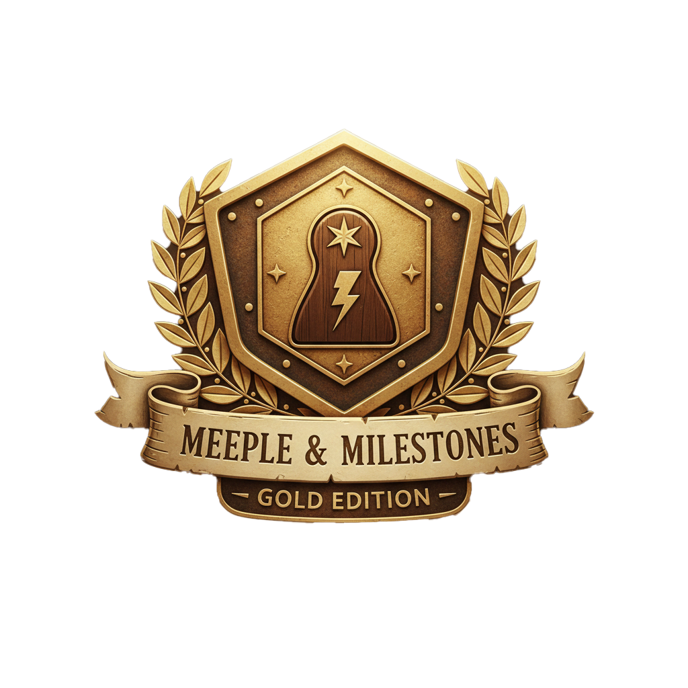

<div align="center">
  <br />
  
  <h1>Meeple & Milestones</h1>
  <p><strong>"L'Âge d'Or — Gravez vos épopées ludiques dans le marbre numérique."</strong></p>

  <p>
    
    
    
  </p>
</div>

---

## 🏛️ L'Esthétique de Prestige

Ce projet refuse la froideur des outils de gestion classiques au profit d'une interface de **Haute Héraldique**. Chaque pixel a été pensé pour sacraliser l'acte de jouer et immortaliser la persévérance des joueurs.

### 🛡️ Le Sceau de l'Architecte

L'identité visuelle est portée par un blason d'orfèvre unique : un médaillon d'**Or Poli** incrusté dans de l'**Obsidienne**, représentant la porte d'un sanctuaire où le Meeple trône en souverain. C'est le sceau authentique de cette édition de prestige.

### 🎨 Palette & Typographies

- **Stone & Amber** : Un mariage de gris ardoise profonds et d'éclats ambrés simulant le relief et la lumière du cuir ancien.
- **Serif Majesty** : Utilisation de polices à empattements pour les titres, évoquant les manuscrits anciens, contrastée par une navigation minimaliste aérée sur une largeur monumentale de **90rem** (1440px), offrant une assise architecturale à l'interface.

---

## 💎 Le Grimoire des Fonctionnalités

### 📖 Chroniques Immersives (Tracking)

- **Le Sceau du Destin** : Chaque partie génère une carte narrative avec un feedback visuel fort. Victoire éclatante ou défaite amère, l'histoire est gravée.
- **Preuve par l'Image** : Immortalisez vos sessions avec un système d'upload multi-photos (via Supabase Storage) pour transformer vos scores en souvenirs tangibles.
- **Timeline Organique** : Vos parties s'affichent sous forme de cartes héraldiques, créant un historique visuel élégant et structuré.

### 🛡️ Le Sanctuaire (Statistiques)

- **KPIs de Prestige** : Suivi du taux de victoire, calcul des "Heures Perdues" (temps de jeu total cumulé) et jauges de challenge circulaires dorées.
- **Visualisation Dynamique** : Graphiques de progression intégrés pour mesurer votre ascension vers la complétion du challenge 10x10.

### 🔍 Bibliothèque & Immersion

- **Extraction BGG Directe** : Importation chirurgicale des métadonnées BoardGameGeek (Note globale, Complexité, Année de parution).
- **Modales d'Orfèvre** : Des fiches de jeux épurées, affichant l'essentiel des statistiques dans un design "Gold" (Temps, Note, Année, Poids).
- **Interface Monolithique** : Un alignement chirurgical entre la Navbar, le Dashboard et le Footer pour une stabilité visuelle totale sur grand écran.

---

## 🏆 Hiérarchie du Sanctuaire (Rangs)

Votre légende s'écrit au fil des parties. Le système de progression débloque des titres honorifiques basés sur votre persévérance ludique :

| Niveau | Titre Royal              | Parties Requises | Icône |
| :----- | :----------------------- | :--------------- | :---- |
| **1**  | Vagabond des Plateaux    | 0+               | 🥾    |
| **2**  | Aventurier Novice        | 5+               | 🎒    |
| **3**  | Chasseur de Reliques     | 15+              | 🔍    |
| **4**  | Stratège Reconnu         | 30+              | 📜    |
| **5**  | **Gardien des Savoirs**  | **50+**          | 🕯️    |
| **6**  | Érudit des Mécaniques    | 65+              | 🏺    |
| **7**  | Maître de la Table       | 80+              | 👑    |
| **8**  | Commandeur Ludique       | 90+              | ⚔️    |
| **10** | **Maître de l'Olympe**   | **100**          | ⚡    |
| **11** | **Architecte du Destin** | **110+**         | 🌌    |

---

## 💾 La Voûte des Données (Structure)

Le projet repose sur quatre piliers relationnels dans **Supabase** pour une synchronisation instantanée :

1. **`games`** : Le registre universel des jeux (Unique par BGG ID), enrichi par l'API BoardGameGeek.
2. **`challenges`** : Le réceptacle des objectifs annuels par utilisateur.
3. **`challenge_items`** : La collection personnelle (Progression, Cible, Couleur du Meeple).
4. **`plays`** : L'archive historique des parties (Images, Durée, Victoire, Notes narratives).

---

## 🛠 Forge Technique

L'infrastructure a été choisie pour sa robustesse et sa capacité à traiter vos données en temps réel dans un environnement sécurisé.

- **Front-end** : React 18 (Vite), Tailwind CSS v3, Recharts.
- **Back-end** : **Supabase** (Database PostgreSQL, Auth, Realtime, Storage).
- **API** : Intégration de la XML API2 de **BoardGameGeek**.
- **Sécurité** : Isolation stricte via **Row Level Security (RLS)** pour protéger chaque grimoire personnel.

---

## 🌳 Workflow de l'Architecte

Pour maintenir l'intégrité de la **Gold Edition**, nous suivons un protocole de branchement (Feature Branching) rigoureux :

1. **`main`** : Le Sanctuaire Sacré. Source de vérité absolue, toujours fonctionnelle et alignée.
2. **Branches `feat/`** : Pour chaque nouvelle quête, une branche dédiée est créée (ex: `feat/alignement-navbar`).
3. **Le Rituel de Fusion** :
   - Développement et commits sur la branche locale.
   - Push vers le dépôt distant.
   - Création d'une **Pull Request (PR)** sur GitHub vers `main`.
   - Fusion après validation des tests visuels et de l'alignement à 90rem.

---

## 💻 Installation du Grimoire

1. **Invocation du Code**
   ```bash
   git clone [https://github.com/Vangelis-26/meeple-milestones.git](https://github.com/Vangelis-26/meeple-milestones.git)
   cd meeple-milestones
   ```
2. **Préparation de la Forge Installez les dépendances nécessaires à la stabilité du manuscrit :**

   ```bash
   npm install
   ```

3. **Sceaux d'Environnement Créez un fichier .env.local à la racine de votre projet et insérez-y vos clés secrètes pour lier le sanctuaire à votre base de données :**
   Créez un fichier `.env.local` à la racine avec vos clés Supabase :

   ```env
   VITE_SUPABASE_URL=votre_url_supabase
   VITE_SUPABASE_ANON_KEY=votre_cle_anon
   ```

4. **Lancement du Sanctuaire Démarrez le serveur de développement pour voir le grimoire s'animer :**
   ```bash
   npm run dev
   ```

---

## ⚖️ Dispositions Légales & Crédits

- **Propriété Intellectuelle** : "Meeple" est une marque déposée de **Hans im Glück**. Ce sanctuaire numérique est une œuvre indépendante réalisée à des fins communautaires et n'est pas affilié à l'éditeur.
- **Données & Sources** : Les métadonnées ludiques (statistiques, historiques, descriptions) sont extraites via l'API de **BoardGameGeek**. Les jaquettes et noms de jeux originaux restent la propriété exclusive de leurs éditeurs respectifs.
- **Design & IA** : Les assets visuels, l'identité **"L'Âge d'Or"** et le sceau héraldique de l'Architecte ont été conçus avec l'assistance créative de **Gemini AI**.
- **RGPD & Confidentialité** : Vos données de chroniqueur sont privées et sécurisées par l'infrastructure Supabase. Vous disposez d'un droit total d'accès, de modification et de suppression de vos informations via votre profil.

---

## 👤 Auteur

**Vangelis** — _Architecte du Destin_ Projet réalisé avec passion pour la communauté ludique.

> _"Le silence est d'or, mais une victoire écrite est éternelle."_
